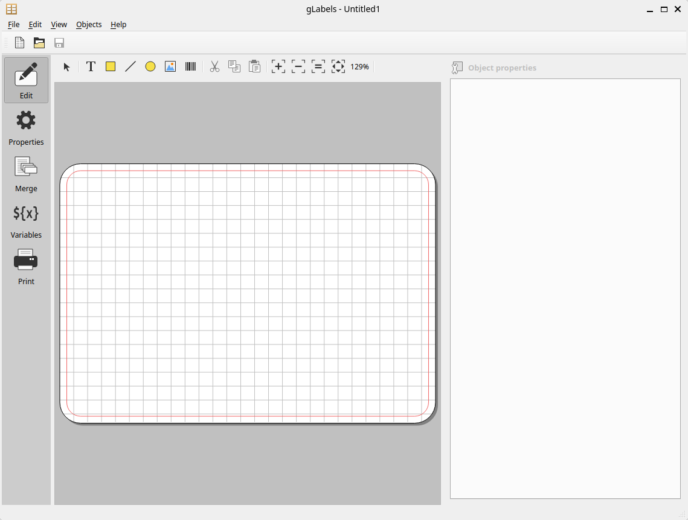
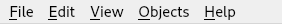
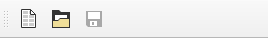
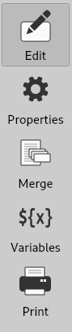
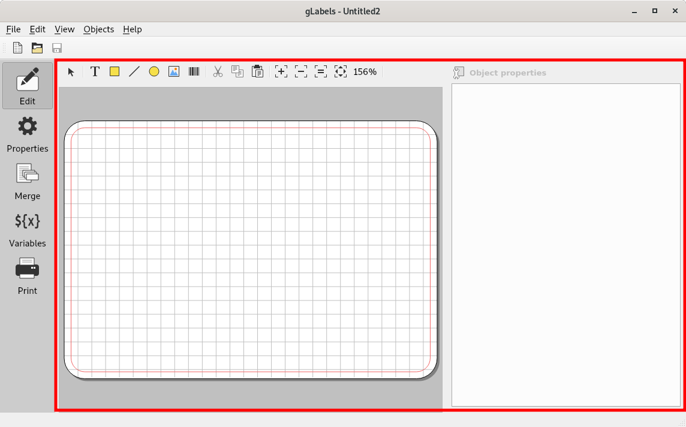

.. _interface:

User Interface Overview
***********************

-------------------
gLabels Main Window
-------------------

Once a gLabels project is opened or created, you will be presented with the main window above.
(See :ref:`starting`, :ref:`createnew`, or :ref:`opening`.) 
This window is divided into several UI elements.
These are a menu bar, a quick-acess tool bar, an activity selection bar, and an activity panel.

--------
Menu Bar
--------

The menu bar, pictured above, includes commands for most top-level user interactions.  It is divided into the following menus

File Menu
---------
This menu contains commands to create, open and save gLabels projects.  It also includes commands switch activities on a project and to create new product templates.

* :menuselection:`&New...` – Create a new gLabels project.  See :ref:`createnew`.

* :menuselection:`&Open...` – Open an existing gLabels project.  See :ref:`opening`.
  file.

* :menuselection:`Open Recent` – Opens a sub-menu for quickly opening recently accessed gLabels projects with a single click.

* :menuselection:`&Save` and :menuselection:`Save &As...` – Save a gLabels project or save it under a new name, respectively.  See :ref:`saving`.

* :menuselection:`&Edit` – Selects the **Edit** activity.  See :ref:`editing`.

* :menuselection:`P&roperties` – Selects the **Properties** activity.  See :ref:`changingproperties`

* :menuselection:`&Merge` – Selects the **Merge** activity.  See :ref:`documentmerge`.

* :menuselection:`&Variables` – Selects the **Variables** activity.  See :ref:`user_defined_variables`.

* :menuselection:`&Print` – Selects the **Print** activity.  See :ref:`printing`.

* :menuselection:`Product Template &Designer...` – Opens the **Product Template Designer** dialog.  See :ref:`template_designer`.

* :menuselection:`&Close` – Closes the current window.

* :menuselection:`E&xit` – Exits from gLabels, closes all open projects.

Edit Menu
---------
This menu contains standard selection and edit commands.  These are primarily used in the **Edit** activity.

* :menuselection:`Undo` and :menuselection:`Redo` – Undo or redo recent modifications to the gLabels project.

* :menuselection:`Cut`, :menuselection:`&Copy`, :menuselection:`&Paste`, :menuselection:`&Delete` – Standard clipboard operations.
  See :ref:`selecting_objects` and :ref:`manipulating_objecs`.

* :menuselection:`Select &All` – Selects all objects.  See :ref:`selecting_objects`.

* :menuselection:`Un-select all` – Un-selects all objects.  See :ref:`selecting_objects`.

* :menuselection:`Preferences` – Edit program preferences.  See :ref:`customizing`.

View Menu
---------
This menu contains commands to control the appearance of gLabels.

* :menuselection:`Toolbars` – Controls visibility of the **Quick-Access** and **Editor** toolbars.

* :menuselection:`Grid` – Controls visibility of the alignment in the label editor in the **Edit** activity.

* :menuselection:`Markup` – Controls visibility of helpful markup lines in the label editor in the **Edit** activity.
  For example, most templates provide markup lines defining a safety margin near the edges of the label or card.

* :menuselection:`Zoom &In`, :menuselection:`Zoom &Out`, :menuselection:`Zoom &1:1`, :menuselection:`Zoom to &Fit` – Standard zoom
  controls for the label editor in the **Edit** activity.

Objects Menu
------------
This menu contains most commands for creating and manipulating objects in the **Edit** activity.

* :menuselection:`Select Mode` – Returns the label editor to the default object selection mode.

* :menuselection:`&Create` – Opens a sub-menu for selecting an object-creation mode.  See :ref:`creating_objects`

* :menuselection:`&Order` – Opens a sub-menu for controlling the stacking order of objects.  See :ref:`editing_object_properties`.

* :menuselection:`&Rotate/Flip` – Opens a sub-menu for controlling rotation and flipping of objects.  See :ref:`editing_object_properties`.

* :menuselection:`&Alignment` – Opens a sub-menu for aligning multiple object to one another.  See :ref:`editing_object_properties`.

* :menuselection:`Center` – Opens a sub-menu for centering (horizontally, vertically, or both) objects on the label or card.  
  See :ref:`editing_object_properties`.

Help Menu
---------
This menu contains commands to display online help and other information about gLabels.

* :menuselection:`&User Manual...` – Opens this user manual.

* :menuselection:`&Report Bug...` – Opens a dialog with instructions on how to report a bug in gLabels.

* :menuselection:`&About...` – Displays version and license information about gLabels.

---------------------
Quick-Access Tool Bar
---------------------

The Quick-Access tool bar, pictured above, allows acces to several of the most common :menuslection:`&File` commands with a single click.
These commands are

* :menuselection:`&New...` – Create a new gLabels project.  See :ref:`createnew`.

* :menuselection:`&Open...` – Open an existing gLabels project.  See :ref:`opening`.
  file.

* :menuselection:`&Save` – Save the current gLabels project.  See :ref:`saving`.

  
----------------------
Activity Selection Bar
----------------------

The Activity Selection Bar, pictured above, is used to quickly switch between activities on the current project, with a single click.

* :guilabel:`Edit` – Selects the **Edit** activity.  See :ref:`editing`.

* :guilabel:`Properties` – Selects the **Properties** activity.  See :ref:`changingproperties`

* :guilabel:`Merge` – Selects the **Merge** activity.  See :ref:`documentmerge`.

* :guilabel:`Variables` – Selects the **Variables** activity.  See :ref:`user_defined_variables`.

* :guilabel:`Print` – Selects the **Print** activity.  See :ref:`printing`.

--------------
Activity Panel
--------------

The appearance of the activity panel, identified by the red box above, depends on the current activity selected.  Pictured above is
the label editor, which is displayed when the **Edit** activity is selected.  The possible activities are

* **Edit** – The panel displays the label editor.  See :ref:`editing`.

* **Properties** – The panel displays the project properties editor.  See :ref:`changingproperties`

* **Merge** – The panel displays the merge editor.  See :ref:`documentmerge`.

* **Variables** – The panel displays the variables editor.  See :ref:`user_defined_variables`.

* **Print** – The panel displays the print controller view.  See :ref:`printing`.

