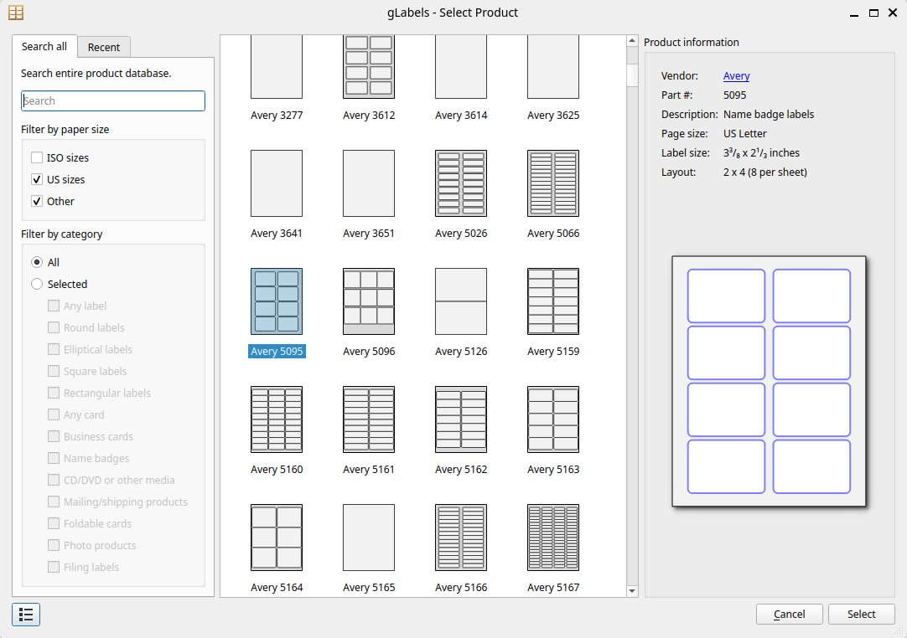

.. _createnew:

Creating a New gLabels Project
******************************

To create a new gLabels project, select the :menuselection:`&File --> &New...` menuitem.
This will display the **Select Product** dialog, shown below.

This dialog will allow you to select a product template for your project.
gLabels includes hundreds of pre-defined product templates.
This dialog has two tabs to help you locate a suitable template: the :guilabel:`Search All` tab, and the :guilabel:`Recent` tab.

Search All Tab
--------------
This tab lets you search the entire gLabels product database.
Search results will be displayed in the selection panel located in the center of this dialog, and will be updated as you edit the filter criteria in this tab.
For a product to appear in the selection panel, all criteria must match.
To edit the filer criteria, you can

#. Type a search string in the :guilabel:`Search` text entry.
   This string will be matched against the "manufacturer part#" string of each product template (E.g. "Avery 5095").
   The search string only needs to be a substring of this string.

#. Select a paper size family with the :guilabel:`Filter by paper size` check boxes.  One or more size families must be selected.

#. Select one or more product categories in the :guilabel:`Filter by category` controls.  You can either select all categories with the :guilabel:`All` radio button, or any combination of individual categories under the :guilabel:`Selected` radio button.

Recent Tab
----------
This tab will limit the products in the selection panel to the 10 most recent products that you have used.

Product Selection
-----------------
To select a product

#. Click on a product in the selection panel.  Information about the selected product will be displayed in the :guilabel:`Product Information` panel located on the right side of this dialog.

#. Confirm the selection by pressing the :guilabel:`Select` button
   A new project will be created by opening a new gLabels window.

