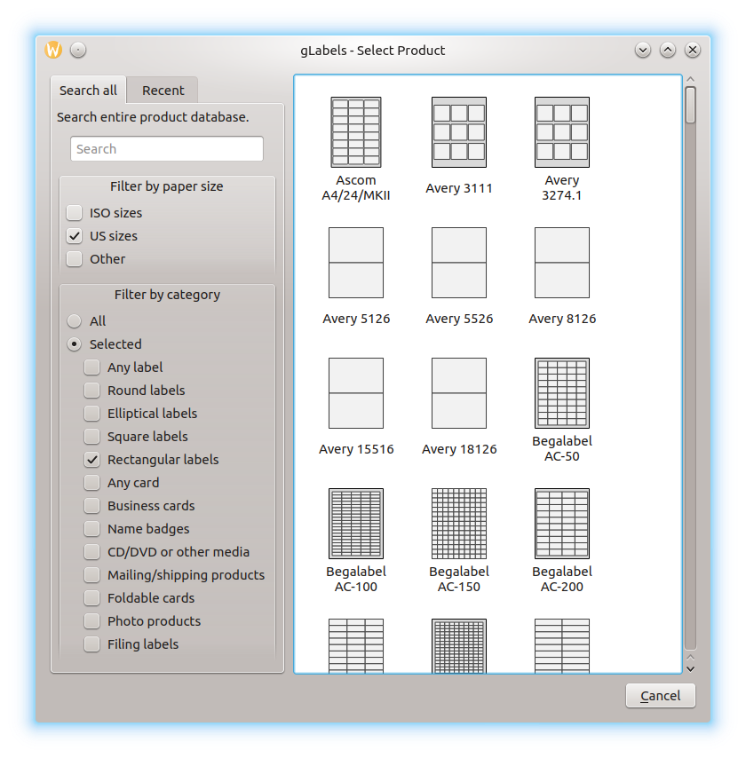

<<<<<<< HEAD
.. _createnew:

Creating a New gLabels Project
******************************

To create a new **gLabels** project, choose **File** ➡ **New…** in the main
window.

The **gLabels – Select Product** window appears. Here you can choose a template
for your new project. If you have already saved projects, the **Recent** tab is
active, and recently used templates are shown. To be able to choose from all
available templates, click on the **Search All** tab, as shown in the following
illustration:

When searching all templates, you have some options to filter the template
collection. You can **Filter by paper size** or **Filter by category**.
For the latter, click on the **Selected** radio button, and then click on one
or more categories that might be relevant to you. Besides that, you can use
the **Search** field to find templates. Just type something like vendor name,
or whatever you know about a template you like to use. Your input will be
applied in addition to the filters already selected, if any.

From this point of view, not all of the template properties are shown. These
can be viewed later in the **Properties** panel (see :ref:`changingproperties`).

Just click on a template to create the new project. It will be opened in a new
window, to prevent you from losing unsaved changes in the previously opened
window.
=======
Creating a New gLabels Project
******************************
>>>>>>> 6db85bc (Create framework for the user manual)
