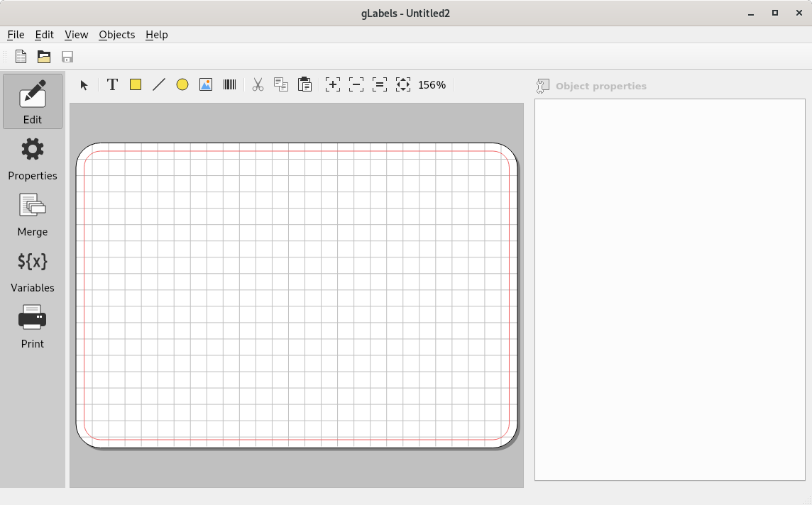
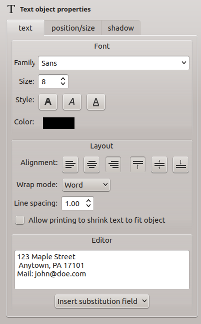

.. _interface:

User Interface Overview
***********************

After opening **gLabels** as described in :ref:`starting` and open a project,
(see also :ref:`opening`) the main window looks as follows:

--------
Menu bar
--------

On top of the window, you see a menubar where you can choose from all actions
**gLabels** offers. Depending on the desktop configuration, the menubar can be
outside the main window (especially on macOS, or when you use the *global menu*
feature in some desktop environments).

Currently, the menubar looks as follows:

.. figure:: ./figures/interface-menu-bar.png

The menu bar has the following entries:

*File* menu
-----------

* *New* – Opens a new project.

* *Open* – Opens a file chooser dialog to open an existing *.glabels* project
  file.

* *Open Recent* – When hovering the mouse pointer on it, a choice of recently
  saved projects will be presented.

* *Save* and *Save As…* – Save a file or save it under a new name,
  respectively.

* *Properties* – Switches to the **Properties** panel.

* *Merge* – Switches to the **Merge** panel.

* *Variables* – Switches to the **Variables** panel.

* *Print* – Switches to the **Print** panel.

* *Product Template Designer* – Opens the **Product Template Designer**
  assistant.

* *Close* – Closes the current window.

* *Exit* – Exits from **gLabels**, closes all open projects.

*Edit* menu
-----------

* *Undo* and *Redo* – Undoes the last edit or repeats a reversed operation.

* *Cut*, *Copy*, *Paste*, *Delete* – In case of an object is focused in the
  drawing area, you can do the named actions.

* *Select All* – Selects all objects.

* *Un-select all* – Un-selects all objects.

*View* menu
-----------

* *Toolbars* – Changes the visibility of the **Quick Access** and **Editor**
  toolbars.

* *Grid* – Shows a grid on the template which helps when aligning objects.

* *Markup* – Shows a red markup line around the template. The area outside this
  line shouldn't be treated as printable. However, for example, to get a
  "borderless" label or card, you can try to draw here. Just test the result
  in a print preview.

* *Zoom In*, *Zoom Out*, *Zoom 1:1*, *Zoom to Fit* – Resizes the view as said.

*Objects* menu
--------------

.. Maybe the function of the *Selct Mode* needs to be more explained.

* *Select Mode* – Activates the **Select Mode**.

* *Create* – When hovering the mouse pointer on it, you can open the
  respective drawing tools from the submenu.

* *Order* – With the submenu entries **Bring To Front** and **Send To Back**
  you can move the focused object into the respective layer. Helpful when
  objects overlap each other, but in a wrong way (for example, when the
  background color has unintentionally come to the foreground and is obscuring
  all other objects.

* *Rotate/Flip* – With the respective submenu entries, you can rotate an object
  in 90 degree steps left or right, or flipping (mirroring) horizontally or
  vertically.

.. *Alignment* is always greyed out; what's the reason?

* *Alignment* – TBD.

* *Center* – Centers an object horizontally or vertically. Centering always
  means in relation to the template, not to any of the other (underlying)
  objects.

*Help* menu
-----------

* *User Manual* – Opens this user manual.

* *Report Bug* – Shows some instructions about how to report a bug, including
  a button to open the issue tracker at Github directly in your browser, and
  a template what you can use for the bug report (with a button for copying
  the template contents conveniently).

* *About* – Shows some information about the **gLabels** project itself.

For all menu items that can also be accessed via a keyboard shortcut, this
shortcut is displayed next to the respective menu item.

.. Maybe a good name: "mode sidebar"

-------
Sidebar
-------

At the left, there is a sidebar which lets you switch between modes. The
initially active **Edit** mode is the *normal* one, where you see the template
and can add or edit objects. In the **Properties** mode, you can view and
change the properties of the template you are using. In the **Merge** mode, you
can perform a document merge (see :ref:`documentmerge`). In the **Variables**
mode, you can add, edit or delete user defined variables (see
:ref:`user_defined_variables`). And last but not least, the **Print** mode
shows some special settings for preparing to print the project (see :ref:`printing`).
The sidebar is always visible; it cannot be hidden.

On top of the window, under the menubar, you see a toolbar with three buttons.
You can here create a new project, open an existing one or save it. By clicking
on the toolbar using the right mouse button, a small context menu named
**Quick Access Toolbar** appears. To hide the toolbar, disable the checkbox.
Alternatively, choose **View** ➡ **Toolbars** ➡ **Quick Access** and enable or
disable the checkbox.

On top of the editor viewport, you have another toolbar with entries for
editing the layout. To hide the editor toolbar, choose
**View** ➡ **Toolbars** ➡ **Editor** and enable or disable the checkbox.

If you are not happy with the placement of the toolbar: Click on the rasterized
area left of the icons in the toolbar. Hold the mouse button pressed, and you
can move the whole toolbar to another place in the window, for example, to the
bottom.

At the right side, you find some settings which are only visible in **Edit**
mode. For example, while a text object is focused:

Use the buttons and input fields to change the properties.
