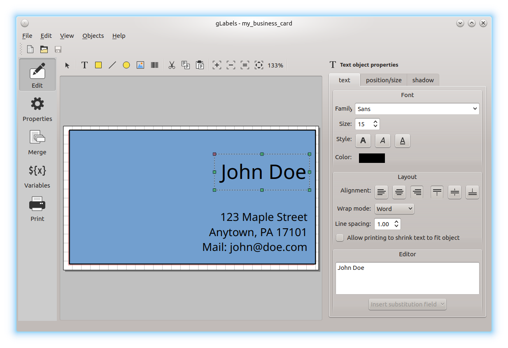
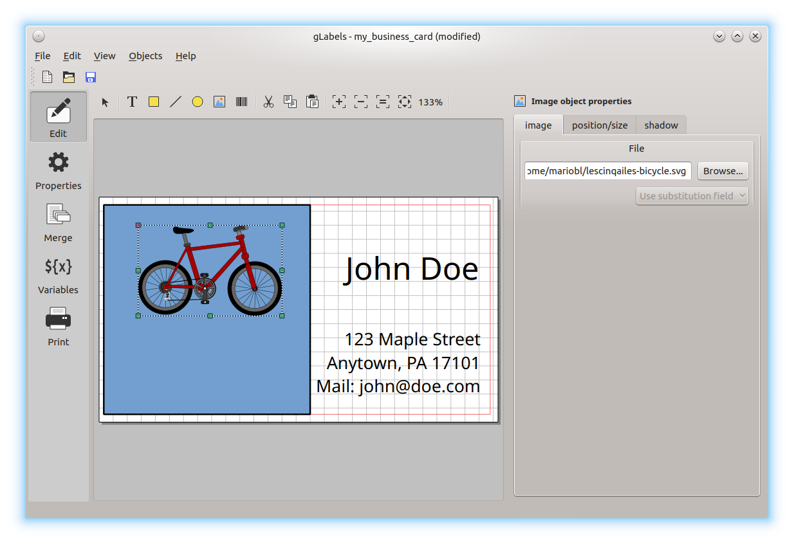

.. _simple_project:

Editing a Label or Card Design
******************************

Let's say you've run out of business cards and don't just want to print new
ones, but rather design a completely new layout.

In **gLabels**, create a new project as described in :ref:`createnew`.
Choose a suitable template for your business cards to be printed (see
:ref:`createnew`).

Think about what your new business card could look like. Your favorite color
would be a good idea, right? So, let's start by coloring the whole card.

Click on the yellow square in the upper toolbar. The mouse pointer now shows a
crosshair and the chosen square. Move the pointer over the drawing area and
click on it, to paste the square. For the time being, the dropped square has a
standard color and standard heigth and width. In the panel on the right, you
can now change the width and color of the surrounding line and the fill color.
Just click on the colors to open a drop-down menu where you can change them.

.. I remember an option in gLabels-3 to rotate text in 90 degree steps...?

Now you can start with adding your name and address. Click on the **T** icon
in the toolbar and click on the label. A text field appears, which you can
resize using the mouse. Type the desired text in the input field in the left
bottom corner of the window.

With the buttons above the text input field, you can change the font properties
and some more like text alignment and so on. Play a bit with the options; maybe
some of them are already known to you from a word processing application.

.. note::
    If you like to have your name in bigger letters than the rest, you will need
    to create multiple text fields. Font property changes always apply to the
    *whole* text field, not only a certain text row.

Have a look at what we now have: Still a bit boring…?

Although it's your favorite color, maybe you like a white background for your
name and address? Click on the colored field and use the mouse pointer on the
edges or corners to resize it. Besides that, a small picture would be nice.
Do you like bicycling? Search the
`Openclipart collection <https://openclipart.org/>`__ for a bike and download
the picture. Now create an image object by clicking on the appropriate icon in
the toolbar and paste it in the template. Probably you will need to resize the
image – in this case, wenn pulling the edges or corners using the mouse, hold
the **Strg** button pressed to keep the aspect ratio (you don't want a bike
with elliptical wheels, right?).

Using just a few basic functions of gLabels, we created a rather attractive
business card:

