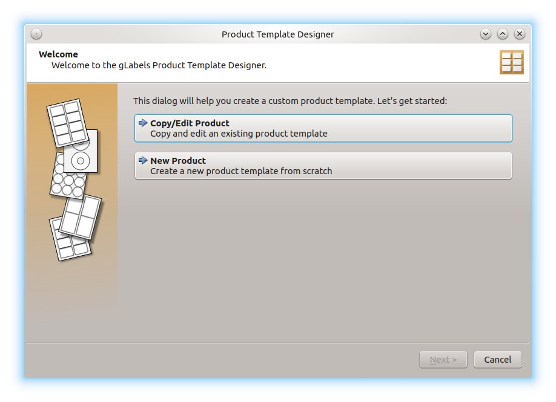
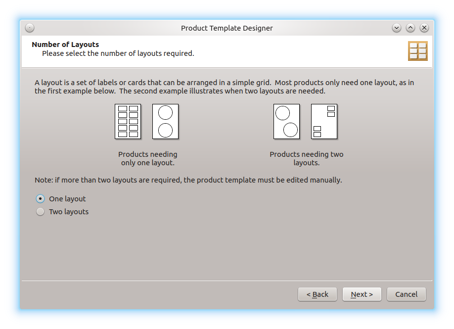
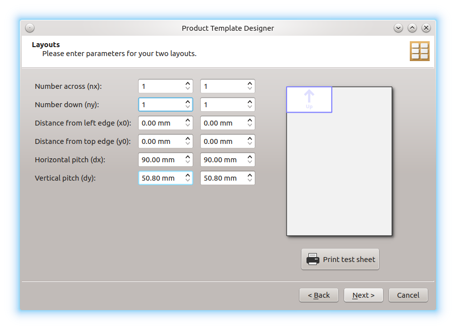

<<<<<<< HEAD
.. _template_designer:

Product Template Designer
*************************

---------------------------
To create a custom template
---------------------------

To create a new custom template, choose
**File** ➡ **Template Designer ...**
to display the **Product Template Designer** dialog.
This dialog will assist you in creating a custom template for
most types of label or card stationery that you may encounter.

.. note::
     If you prefer, you can create your templates manually.
     For this option see :ref:`mancreate`

In the **Product Template Designer** dialog, you can choose between two
options:

Choose **Copy/Edit Product** if you like to reuse an existing product and
change the values. If you like to create a new template from scratch, then
choose **New Product**.

Use an existing product
-----------------------

If you have choosen for using an existing product, the
**gLabels – Select Product** dialog appears, where you can choose the
desired template (see :ref:`createnew`). In the next window, the fields
with the template properties are already filled with the known values.
Adjust the values ​​to your liking and click on **Next**. In the next window,
you can change the page size. Open the **Page size:** drop-down menu by
clicking on it, and choose from the predefined paper sizes, or use the input
fields below to specify the paper size yourself. Click on **Next** again. In
the following windows, you can specify shape and size of the product. After
that, you have to specify the product layout:

Sometimes, a stationery product contains to layouts at the same paper
sheet. This is the case, for example, with stickers for CDs, which also
contain rectangular stickers on the same sheet. If you have such a product,
choose for **Two layouts**.

.. note::
     The template designer does not support the rarely encountered products
     with more than two layouts. However, you can create such a template
     manually, see :ref:`mancreate`.

After clicking on **Next** again, you can specify the values for the
different layouts:

Once you are finished, you can test the layout by clicking on
**Print test sheet**. To avoid excessive paper waste, you should print into a
PDF file for your first attempts.

In the last window of the assistant, click on **Save** to save the new template.
It will be presented next time you create a new project.

.. _submit_templates:

Create a new product template from scratch
------------------------------------------

If you have choosen for creating a new product template, you follow the same
steps as above. The only difference is that no values ​​have been entered yet
and you have to fill everything in yourself. This makes sense if you haven't
found any similar templates in the collection.

.. note::
    The template file itself is located in *~/.config/glabels.org/glabels-qt/*,
    if you like to edit it manually. Please also consider to send the file to
    the developers for inclusion in a future **gLabels** release. To submit it,
    `Open an issue at <https://github.com/j-evins/glabels-qt/issues/new>`__ and
    attach your completed product template file(s).

=======
Product Template Designer
*************************
>>>>>>> 6db85bc (Create framework for the user manual)
