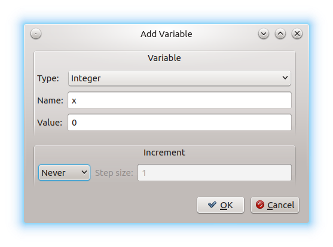

.. _user_defined_variables:

Creating User-Defined Variables
*******************************

.. The use cases for variables need to be explained before describing the
   workflow.

After opening a new project, you can set user-defined variables. Click on
**Variables** in the toolbar on the left. At this time, no variables area
defined. Click on **Add** at the bottom of the window. The
**Add variable** window appears:

Now you can open the **Type:** drop-down menu to choose the type from
**String**, **Integer**, **Floating Point**, and **Color**. After
adding the desired name and value, click on the drop-down menu in the left
bottom corner of the window to configure the incrementation. After clicking on
**OK**, the new variable appears in the list, and you can edit or delete it (or
even add another one) by clicking on the buttons at the bottom of the window.
